##Git在脚本与cocoapods中的使用
用cocoapods的同志们都会面临一个问题：如果我找到了一个非常适合我的三方类库，但是有些定制不能满足我，我一定要改这个类库怎么办？

**AFNetworking**大家都再熟悉不过了，我们经历了一个阵痛期那就是ipv6，3.0倒是支持，但是API变了不少，如果代码结构没有设计的太好，那改动又比较大，2.0版本需要改一些东西，直接在cocoapods里改？然后就蹦出来一个这个

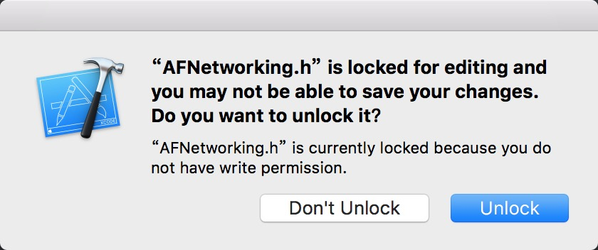

点了Unlock就可以改了，但是不建议这么做啊<**你本地改了，但是你队友收不到你的更改，提交代码的时候我们一般只提交自己写的东西, 至少不会提交pod里的内容, .gitigonre里会停止追踪别人的代码**>？clone下来，改了再提交上去，不一定会被作者收录，反正我这水平人家是不会接受我提交的更改。不过我们可以到 **AFNetworking** 主页去fork下来，然后自己想怎么改怎么改，最后在podFile里拉去你要的版本即可。

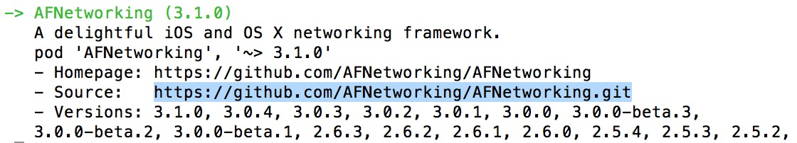

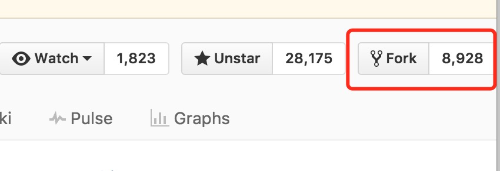

然后clone下来，比如我fork到我的git里了，git路径就是[https://github.com/yhl714387953/AFNetworking.git](https://github.com/yhl714387953/AFNetworking.git)

那么你改吧改吧提交上去，随便你怎样做标记，commit、tag、branch，当然这都是git的操作了，我们在podFile里可以这样写

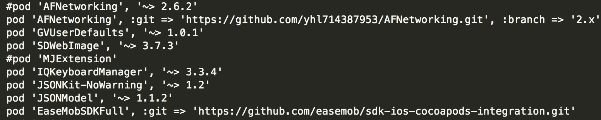

上图第一行就是我们更改过后创建的一个分支，最下面一行是环信的，它没有指定commit、tag、branch，当然人家就这么一个版本。

**开场白说的有点多了，下面回到正题**

本来打算接下来的篇文章是讲解脚本和cocoapods的，后来发现git在里面发挥着比较大的作用，不管你cocoapods怎么写，最终资源还是在git上了<**当然也可能在SVN或者自己的服务器上，也有可能在本地**> 终究逃脱不了git的各种操作，如果系统的学一下呢，还是推荐这个网站 [廖雪峰的官方网站](http://www.liaoxuefeng.com/)。
推荐两款GUI工具

**GitHub Desktop** 可以直接把本地的项目public到你的gitHub上，当然你说你不用也可以，最后push的时候会提示你输入帐号和密码

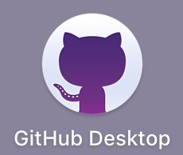 

**SourceTree**让多少人解放了git命令啊，敲来敲去感觉逼格挺高，其实GUI工具的出现就是为了让人有更高的开发效率，当然命令行多多少少也要知道一些


###git仓库的创建
像我这种半路出家搞IOS的人，很少会在意git仓库创建的问题，反正就知道会有人给我个地址，我给生成个pub文件，然后就能拉取代码和资源了，然后我在终端cd 到一个目录下，咔嚓一执行
```
git clone git@www.zuiye.com/ios 
```

我这个目录里就有了资源了
当然你要是觉得命令麻烦，那就在用sourceTree去添加
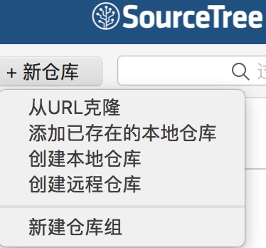

或者用GitHubDesktop

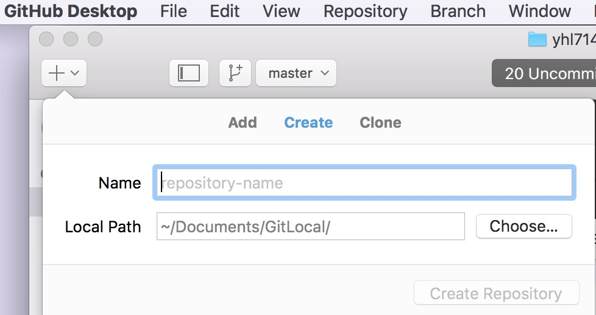

 或者直接登录gitHub官网
 
 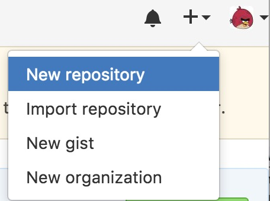
 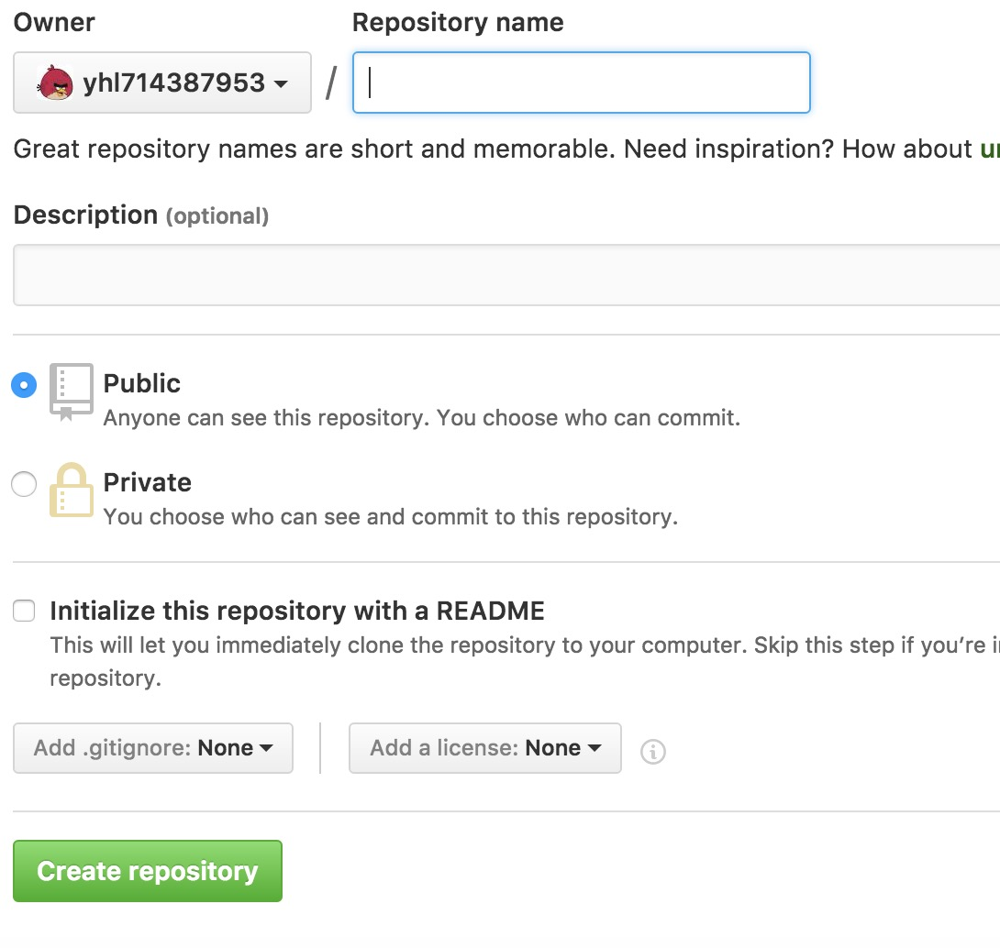
 
 然后你再clone下来
 
 再不济，那就直接命令行
 
 ```
 git init
 ```
 
 **等等** 插播一段广告，如果你玩命令行，那我强烈推荐[oh-my-zsh](https://github.com/robbyrussell/oh-my-zsh) 有多牛我不知道，但是
 
**oh-my-zsh**
 
 
 **AFNetworking**
 
 
 这个玩意到底干嘛的，安装一次你就知道了，系统那个命令行简直是不忍直视、无法使用啊！
 
###.gitignore 配置
 如果在gitHub上创建项目会发现强制要求你有.gitignore 文件，如果clone下来的项目或者新创建的仓库没有.gitignore文件咋整，不咋整，创建一个。这是一个隐藏文件，我们可以用命令行创建，vim编辑，当然你直接用text编辑也没事，不过我在编辑podFile和 podSpec的时候被文本编辑器搞疯了，后来只能用sublime了。
 创建一个.gitignore
 
 ```
 touch .gitignore
 ```
 
 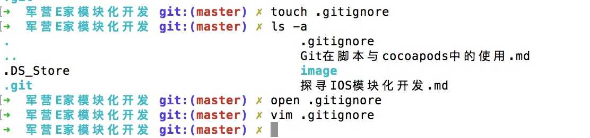
 
 编辑gitignore我推荐 vim， vim 是啥？不知道，有人跟我说vim好比大师，记事本好比入门的菜鸟，反正我不是大师，也不用vim，我都直接open 去编辑的。当时我笨的啊，我问他们怎么退出vim 编辑？细复特冒号Q。
 
在模块化开发的时候我就不配置停止追踪的文件，我是直接让所有的人都配置成要跟踪的文件，每个人只追踪自己开发模块的东西。很多人讨厌storyboard、xib 说是查看一下，git都认为修改了，那好吧，你可以在.gitignore里修改配置下，.gitignore一般我是不定期的修改。我创建了一个项目忽略了pod，我们看看有多少文件没有被追踪

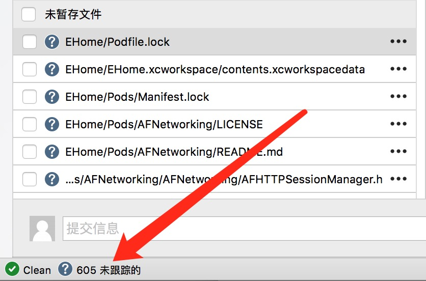


cocoapods里的东西是强烈建议不要让git去追踪，因为会让你的代码库变得超级大，然后我们就发现了，好多github上的三方类库，下载下来先要执行 pod install。

.gitignore 的配置，有人整理了一套，关于各种语言的gitignore
[https://github.com/github/gitignore](https://github.com/github/gitignore)  看星星数，那也指定差不了，我先给打个广告。


 
***

**我怎么感觉说一堆，没说到点子上呢，那就当零散的知识去说吧**

***

 我们在脚本的前两行会写上
 
 ```
 git reset --hard
 git pull
 ```
 
 是啊，本地没有commit的东西，也执行不了pull操作，强制reset回去是因为在打包之前，可能有没有必要的改动，只有配置和码代码的人改动的才是有必要的改动。
 
****

感谢您阅读完毕，如有疑问，欢迎添加QQ:**714387953**(蜗牛上高速)。
**github**:[https://github.com/yhl714387953](https://github.com/yhl714387953)
如果有错误，欢迎指正，一起切磋，共同进步
如果喜欢可以**Follow、Star、Fork**，都是给我最大的鼓励