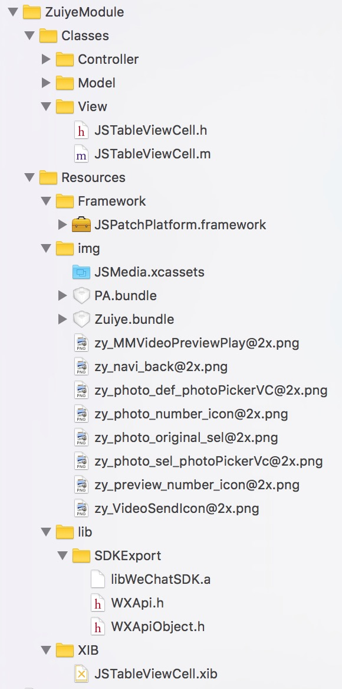
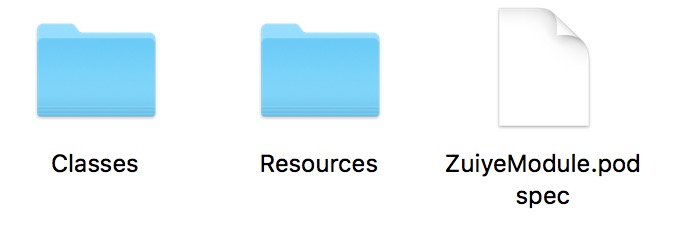
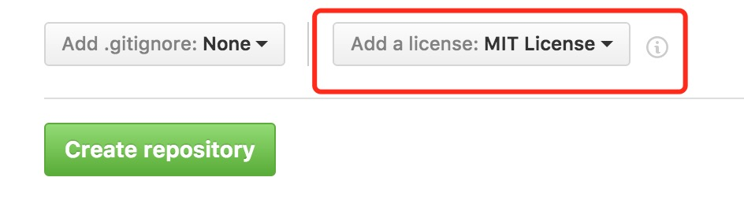
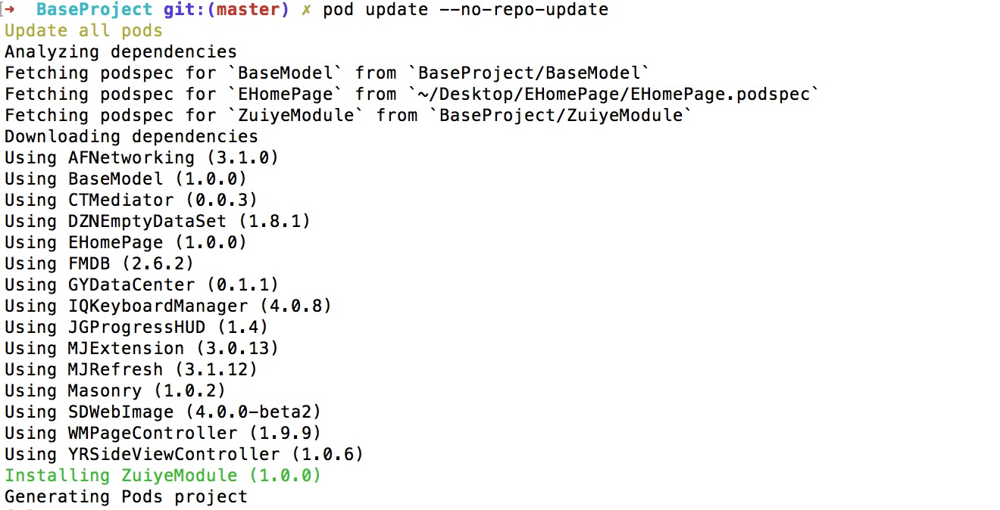
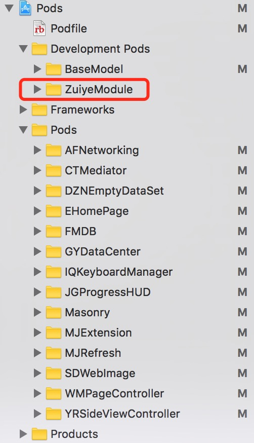
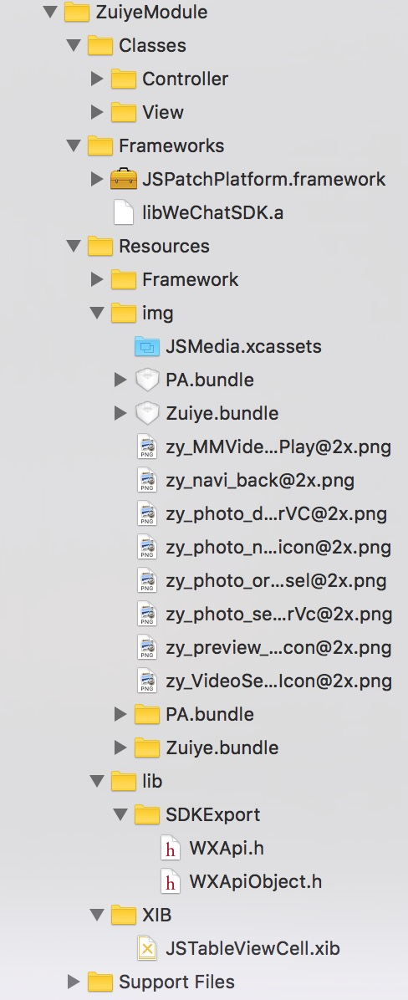

##cocoapods助力组件化
这一阵子搞模块化开发，碰到了好多问题，一直没时间写，结果还把工作计划给忘了，上午被老大数落一顿，失职，失职……

推荐个写项目计划的软件啊，windows上很多人用project，Mac那就非**omniPlan**莫属了


**为什么最后敲定选用cocoapods来进行模块化开发呢**

因为我不会用linux 命令去改xcode的buildSettins，当然，如果有会的留言或者私信告诉我，不胜感激……报酬是**你出花生我出酒，致真大厦整两口** PS:本人不敢喝酒哈~

最好的学习cocoapods当然是到官网了 [https://cocoapods.org/](https://cocoapods.org/)。 从安装到使用都比较全面，当然在安装或者使用过程中，如果有问题，那就谷歌百度，各种谷歌百度各种的有解决方法。本片文章通过**podspec**文件的编写，讲述如何使用cocoapods实现模块化开发。

一说到要自己创建pod管理，一谷歌百度就是

```
pod trunk push NAME.podspec
```

很多都纠结在

```
cd ~/code/Pods/NAME
pod lib lint
```

这里不用纠结了，为啥呢？因为你在做项目呢，你肯定不能公开你的东西，项目都是存放在自己git服务器上了。当然以后肯定要 **pod trunk push** 上去的，因为开源一直都是我力赞的……

创建过程详见官网[Making a CocoaPod](https://guides.cocoapods.org/making/making-a-cocoapod.html)。

这里我们根据资源的存放位置分为三种：
> * public server (比如gitHub，谁都能看到)
> * private server (自己的git服务器了，自己和管理员能看见)
> * local (存在本地磁盘的一个角落里，自己偷着看)

通过podspec我们来分析具体的实现，首先到我们对应的模块文件夹下创建一个podspec，名字呢，我建议跟你的模块名字一样，你要不一样倒也无妨反正。看看我们这个模块的文件夹目录结构，podspec按照这个结构去写的，当然怎么写那都无所谓啊，看个人喜好，下面的目录结构只是用来举栗子的，下面我举个栗子：

**ZuiyeModule** 有这么个模块，结构如下



各种各样的文件是吧，尽可能的全乎，在命令行里先进到**ZuiyeModule**这个目录下，创建一个podspec

```
pod spec create ZuiyeModule
```

该文件夹下就创建了一个这样的podspec文件



我们打开看一下

``` 
open ZuiyeModule.podspec 
```

内如如下

```
#
#  Be sure to run `pod spec lint ZuiyeModule.podspec' to ensure this is a
#  valid spec and to remove all comments including this before submitting the spec.
#
#  To learn more about Podspec attributes see http://docs.cocoapods.org/specification.html
#  To see working Podspecs in the CocoaPods repo see https://github.com/CocoaPods/Specs/
#

Pod::Spec.new do |s|

  # ―――  Spec Metadata  ―――――――――――――――――――――――――――――――――――――――――――――――――――――――――― #
  #
  #  These will help people to find your library, and whilst it
  #  can feel like a chore to fill in it's definitely to your advantage. The
  #  summary should be tweet-length, and the description more in depth.
  #

  s.name         = "ZuiyeModule"
  s.version      = "0.0.1"
  s.summary      = "A short description of ZuiyeModule."

  # This description is used to generate tags and improve search results.
  #   * Think: What does it do? Why did you write it? What is the focus?
  #   * Try to keep it short, snappy and to the point.
  #   * Write the description between the DESC delimiters below.
  #   * Finally, don't worry about the indent, CocoaPods strips it!
  s.description  = <<-DESC
                   DESC

  s.homepage     = "http://EXAMPLE/ZuiyeModule"
  # s.screenshots  = "www.example.com/screenshots_1.gif", "www.example.com/screenshots_2.gif"


  # ―――  Spec License  ――――――――――――――――――――――――――――――――――――――――――――――――――――――――――― #
  #
  #  Licensing your code is important. See http://choosealicense.com for more info.
  #  CocoaPods will detect a license file if there is a named LICENSE*
  #  Popular ones are 'MIT', 'BSD' and 'Apache License, Version 2.0'.
  #

  s.license      = "MIT (example)"
  # s.license      = { :type => "MIT", :file => "FILE_LICENSE" }


  # ――― Author Metadata  ――――――――――――――――――――――――――――――――――――――――――――――――――――――――― #
  #
  #  Specify the authors of the library, with email addresses. Email addresses
  #  of the authors are extracted from the SCM log. E.g. $ git log. CocoaPods also
  #  accepts just a name if you'd rather not provide an email address.
  #
  #  Specify a social_media_url where others can refer to, for example a twitter
  #  profile URL.
  #

  s.author             = { "yuhailong" => "714387953@qq.com" }
  # Or just: s.author    = "yuhailong"
  # s.authors            = { "yuhailong" => "714387953@qq.com" }
  # s.social_media_url   = "http://twitter.com/yuhailong"

  # ――― Platform Specifics ――――――――――――――――――――――――――――――――――――――――――――――――――――――― #
  #
  #  If this Pod runs only on iOS or OS X, then specify the platform and
  #  the deployment target. You can optionally include the target after the platform.
  #

  # s.platform     = :ios
  # s.platform     = :ios, "5.0"

  #  When using multiple platforms
  # s.ios.deployment_target = "5.0"
  # s.osx.deployment_target = "10.7"
  # s.watchos.deployment_target = "2.0"
  # s.tvos.deployment_target = "9.0"


  # ――― Source Location ―――――――――――――――――――――――――――――――――――――――――――――――――――――――――― #
  #
  #  Specify the location from where the source should be retrieved.
  #  Supports git, hg, bzr, svn and HTTP.
  #

  s.source       = { :git => "http://EXAMPLE/ZuiyeModule.git", :tag => "#{s.version}" }


  # ――― Source Code ―――――――――――――――――――――――――――――――――――――――――――――――――――――――――――――― #
  #
  #  CocoaPods is smart about how it includes source code. For source files
  #  giving a folder will include any swift, h, m, mm, c & cpp files.
  #  For header files it will include any header in the folder.
  #  Not including the public_header_files will make all headers public.
  #

  s.source_files  = "Classes", "Classes/**/*.{h,m}"
  s.exclude_files = "Classes/Exclude"

  # s.public_header_files = "Classes/**/*.h"


  # ――― Resources ―――――――――――――――――――――――――――――――――――――――――――――――――――――――――――――――― #
  #
  #  A list of resources included with the Pod. These are copied into the
  #  target bundle with a build phase script. Anything else will be cleaned.
  #  You can preserve files from being cleaned, please don't preserve
  #  non-essential files like tests, examples and documentation.
  #

  # s.resource  = "icon.png"
  # s.resources = "Resources/*.png"

  # s.preserve_paths = "FilesToSave", "MoreFilesToSave"


  # ――― Project Linking ―――――――――――――――――――――――――――――――――――――――――――――――――――――――――― #
  #
  #  Link your library with frameworks, or libraries. Libraries do not include
  #  the lib prefix of their name.
  #

  # s.framework  = "SomeFramework"
  # s.frameworks = "SomeFramework", "AnotherFramework"

  # s.library   = "iconv"
  # s.libraries = "iconv", "xml2"


  # ――― Project Settings ――――――――――――――――――――――――――――――――――――――――――――――――――――――――― #
  #
  #  If your library depends on compiler flags you can set them in the xcconfig hash
  #  where they will only apply to your library. If you depend on other Podspecs
  #  you can include multiple dependencies to ensure it works.

  # s.requires_arc = true

  # s.xcconfig = { "HEADER_SEARCH_PATHS" => "$(SDKROOT)/usr/include/libxml2" }
  # s.dependency "JSONKit", "~> 1.4"

end


```

我们看一下都需要配置哪些参数，没加#注释的都是必要的字段

***

```
s.name         = "ZuiyeModule"
s.version      = "0.0.1"
s.summary      = "A short description of ZuiyeModule."

```

name、version、summary这个比较直观哈
***

```
  s.description  = <<-DESC
                   DESC
```
 
描述，在**DESC**中间写，比如

```
 s.description  = <<-DESC
		  这个是我测试的，这个模块主要实现自定义功能
                   DESC
```
***

```
s.homepage     = "http://EXAMPLE/ZuiyeModule"
```

主页么，没要求，随便写，但也别太随便了，最好是当前模块在git的主页（如果你是本地的pod类库，那这个也没有用）

***

```
 s.license      = "MIT (example)"
```
 
 如果你在gitHub上创建项目这个是必选的
 
 
 
 ```
  s.license      = "MIT"
 ```
 ***
 
 ```
 s.author             = { "yuhailong" => "714387953@qq.com" }
 ```
 
 作者： 嘴爷
 ***
 
 ```
  # s.platform     = :ios, "8.0"
 ```
 
 平台：IOS 	最低版本：8.0
 ***
 
 
 ```
 # deployment_target或者s.platform不开启，那在使用的时候会有arc问题(后续podspec文件中设置只支持arc)
  # 比如__weak不能使用
  
  #  When using multiple platforms
  # s.ios.deployment_target = "5.0"
  # s.osx.deployment_target = "10.7"
  # s.watchos.deployment_target = "2.0"
  # s.tvos.deployment_target = "9.0"
  
 ```
 
 部署版本
 
  deployment_target或者s.platform不开启，那在使用的时候会有arc问题(后续podspec文件中设置只支持arc) 比如__weak不能使用， 
  设置了 **s.platform** 后，这个可以不用管
 
 ***
 
 ```
 s.source       = { :git => "http://EXAMPLE/ZuiyeModule.git", :tag => "#{s.version}" }
 ```

资源的git 地址，四种写法，喜欢哪种随意

```
# source的写法可以参照下面的写法
#pod 'VenderName', :git => 'https://github.com/zuiye/ZuiyeSDK.git', :tag => '0.7.0'
#pod 'VenderName', :git => 'https://github.com/zuiye/ZuiyeSDK.git', :branch => 'develop'
#pod 'VenderName', :git => 'https://github.com/zuiye/ZuiyeSDK.git', :commit => '082f8319af'
# 当引用本地的时候这个参数就没有用了
  s.source       = { :git => "local" }
```

***

```
s.source_files  = "Classes", "Classes/**/*.{h,m}"
```

代码文件，**Classes** 文件夹，/\*\*/ 表示文件夹下的所有文件和文件夹， *.{h,m} 表匹配该文件夹下的所有.h .m文件，多个文件路径用逗号分开

```
# 所有需要引用的文件都要添加进来 /**/表示所有文件夹 *.{文件后缀}代表所有符合后缀名的文件
  s.source_files  = "Classes", "Classes/**/*.{h,m}", "Resources/**/*.{h,m}"
```
***

```
# s.resource  = "icon.png"
  # s.resources = "Resources/*.png"
```
资源文件，我理解的是除了代码之外的所有文件.asset .a .framework. .xib .storyboard等等

```
# png,xib,framework,a,bundle 等必须当资源文件去添加
  s.resource  = 'Resources/**/*.{png,xib,framework,a,bundle,xcassets}'
  # s.resources = "Resources/*.png"

```

***

```
# s.preserve_paths = "FilesToSave", "MoreFilesToSave"
```

framework 要加preserve_paths 预加载路径

```
# framework 要加preserve_paths 预加载路径
  s.preserve_paths = "Resources/**/*.{framework,a}"
```

***

```
# s.framework  = "SomeFramework"
# s.frameworks = "SomeFramework", "AnotherFramework"

# s.library   = "iconv"
# s.libraries = "iconv", "xml2"
```

以上要注意多个framework或者library用逗号分开就行，这个是系统的，如果是三方的framework 或者 library呢

```
# ――― Linking 相关参数说明―――――――――――――――――――――――――――――――――――――――――――――――――――――――――― #

  # s.libraries  表示这个pod依赖的 苹果官方的库，也就是类似libstdc++.a ,libsqlite.a 等等的a文件；
  # s.vendored_libraries 就表示用户自己的a文件，比如新浪微博SDK的libWeiboSDK.a, 微信libWeChatSDK.a；
  # s.frameworks 表示pod依赖的 苹果的framework， 比如 UIKit，SystemConfiguration等等
  # s.vendored_frameworks， 表示pod依赖的自己的framework，比如QQSDK的TencentOpenAPI.framework，JSPatch热更新JSPatchPlatform.framework;
  # .a 或者 libz.tbd 后缀不要，名字里lib开头的三个字母不要，libz.tbd 应写成 'z'

# ――― Linking 相关参数说明 ―――――――――――――――――――――――――――――――――――――――――――――――――――――――――― #
```

针对本模块的写法示例

```
 # s.library   = 'z'
  s.libraries =  'iconv','sqlite3','stdc++','z'

  s.vendored_libraries  = 'Resources/lib/**/*.{a}'
  s.vendored_frameworks = 'Resources/Framework/**/*.{framework}'
```

***

```
# s.requires_arc = true
```
ARC

***

```
#s.xcconfig = { "HEADER_SEARCH_PATHS" => "$(SRCROOT)/usr/include/libxml2" }
#s.xcconfig = { 'LIBRARY_SEARCH_PATHS' => '"$(PODS_ROOT)/xxx/xxx"' }
#s.xcconfig = { "FRAMEWORK_SEARCH_PATHS" => "Resources/Framework" }
```
这个配制想必大家在没用pod的时候，引入三方的时候，多多少少都要改点

***

```
# s.dependency "JSONKit", "~> 1.4"
```

依赖，可以依赖本地写法就好比podFile中的写法，多个依赖，那就多写几行

```
s.dependency "JSONKit", "~> 1.4"
s.dependency 'BaseModel', :path => 'BaseProject/BaseModel'
```
**因为有依赖了，所以AFNetworking、SDWebImage什么的可以不用写的podFile里了**


###podFile中的写法

```
# ―――  PodFile 中的写法可以如下 ―――――――――――――――――――――――――――――――――――――――――――――――――――――――――― #
#组件通信  如果提交到spec仓库，并审核通过
#pod 'CTMediator', '~> 0.0.3'

# 以下所有的spec文件都没有提交到spec仓库
#首页   代码在git上
#pod 'EHomePage', :git =>  'https://github.com/yhl714387953/EHomePage.git'

#首页使用本地代码   git上有相关的代码  这里用的绝对路径，不建议，可仿如下用相对路径
#pod 'EHomePage', :podspec => '~/Desktop/EHomePage/EHomePage.podspec'

#首页使用本地代码  代码只在本地了，文件路径可以直接简写成PodFile所在文件夹之后的路径
#pod 'BaseModel', :path => 'BaseProject/BaseModel'
# ―――  PodFile 中的写法可以如上 ―――――――――――――――――――――――――――――――――――――――――――――――――――――――――― #

```

我们podspec写完了，执行下

```
pod update --no-repo-update
```



我们看看项目里的结构



后添加的模块ZuiyeModel目录结构



细心的同仁们会发现classes文件夹里少了个Model文件夹，因为那个文件夹里我没有东西。

新添加的 **ZuiyeModel** 在 **Development Pods** 文件夹下了，如果你觉得写的麻烦，那就按我的文件目录放置，**podspec** 文件内容都复制过去然后改个**s.name** 就行了

```
s.name         = "自己的模块名字"
```

现成的大鱼在下面了(**podspec** 内容)

```
# ―――  PodFile 中的写法可以如下 ―――――――――――――――――――――――――――――――――――――――――――――――――――――――――― #
#组件通信  如果提交到spec仓库，并审核通过
#pod 'CTMediator', '~> 0.0.3'

# 以下所有的spec文件都没有提交到spec仓库
#首页   代码在git上
#pod 'EHomePage', :git =>  'https://github.com/yhl714387953/EHomePage.git'

#首页使用本地代码   git上有相关的代码  这里用的绝对路径，不建议，可仿如下用相对路径
#pod 'EHomePage', :podspec => '~/Desktop/EHomePage/EHomePage.podspec'

#首页使用本地代码  代码只在本地了，文件路径可以直接简写成PodFile所在文件夹之后的路径
#pod 'BaseModel', :path => 'BaseProject/BaseModel'
# ―――  PodFile 中的写法可以如上 ―――――――――――――――――――――――――――――――――――――――――――――――――――――――――― #


#
#  Be sure to run `pod spec lint JSPatchModule.podspec' to ensure this is a
#  valid spec and to remove all comments including this before submitting the spec.
#
#  To learn more about Podspec attributes see http://docs.cocoapods.org/specification.html
#  To see working Podspecs in the CocoaPods repo see https://github.com/CocoaPods/Specs/
#

Pod::Spec.new do |s|

  # ―――  Spec Metadata  ―――――――――――――――――――――――――――――――――――――――――――――――――――――――――― #
  #
  #  These will help people to find your library, and whilst it
  #  can feel like a chore to fill in it's definitely to your advantage. The
  #  summary should be tweet-length, and the description more in depth.
  #

  s.name         = "ZuiyeModule"
  s.version      = "1.0.0"
  s.summary      = "测试资源文件，png、 xib、 bundle、 a、 framework"

  # This description is used to generate tags and improve search results.
  #   * Think: What does it do? Why did you write it? What is the focus?
  #   * Try to keep it short, snappy and to the point.
  #   * Write the description between the DESC delimiters below.
  #   * Finally, don't worry about the indent, CocoaPods strips it!
  s.description  = <<-DESC
                      测试资源文件
                   DESC

  s.homepage     = "www.zuiye.com"
  # s.screenshots  = "www.example.com/screenshots_1.gif", "www.example.com/screenshots_2.gif"


  # ―――  Spec License  ――――――――――――――――――――――――――――――――――――――――――――――――――――――――――― #
  #
  #  Licensing your code is important. See http://choosealicense.com for more info.
  #  CocoaPods will detect a license file if there is a named LICENSE*
  #  Popular ones are 'MIT', 'BSD' and 'Apache License, Version 2.0'.
  #

  s.license      = "MIT"
  # s.license      = { :type => "MIT", :file => "FILE_LICENSE" }


  # ――― Author Metadata  ――――――――――――――――――――――――――――――――――――――――――――――――――――――――― #
  #
  #  Specify the authors of the library, with email addresses. Email addresses
  #  of the authors are extracted from the SCM log. E.g. $ git log. CocoaPods also
  #  accepts just a name if you'd rather not provide an email address.
  #
  #  Specify a social_media_url where others can refer to, for example a twitter
  #  profile URL.
  #

  s.author             = { "yuhailong" => "714387953@qq.com" }
  # Or just: s.author    = "yuhailong"
  # s.authors            = { "yuhailong" => "714387953@qq.com" }
  # s.social_media_url   = "http://twitter.com/yuhailong"

  # ――― Platform Specifics ――――――――――――――――――――――――――――――――――――――――――――――――――――――― #
  #
  #  If this Pod runs only on iOS or OS X, then specify the platform and
  #  the deployment target. You can optionally include the target after the platform.
  #

  s.platform     = :ios
  s.platform     = :ios, "8.0"

  #  When using multiple platforms
  # s.ios.deployment_target = "5.0"
  # s.osx.deployment_target = "10.7"
  # s.watchos.deployment_target = "2.0"
  # s.tvos.deployment_target = "9.0"


  # ――― Source Location ―――――――――――――――――――――――――――――――――――――――――――――――――――――――――― #
  #
  #  Specify the location from where the source should be retrieved.
  #  Supports git, hg, bzr, svn and HTTP.
  #

# source的写法可以参照下面的写法
#pod 'VenderName', :git => 'https://github.com/zuiye/ZuiyeSDK.git', :tag => '0.7.0'
#pod 'VenderName', :git => 'https://github.com/zuiye/ZuiyeSDK.git', :branch => 'develop'
#pod 'VenderName', :git => 'https://github.com/zuiye/ZuiyeSDK.git', :commit => '082f8319af'
# 当引用本地的时候这个参数就没有用了
  s.source       = { :git => "local" }


  # ――― Source Code ―――――――――――――――――――――――――――――――――――――――――――――――――――――――――――――― #
  #
  #  CocoaPods is smart about how it includes source code. For source files
  #  giving a folder will include any swift, h, m, mm, c & cpp files.
  #  For header files it will include any header in the folder.
  #  Not including the public_header_files will make all headers public.
  #
  # 所有需要引用的文件都要添加进来 /**/表示所有文件夹 *.{文件后缀}代表所有符合后缀名的文件
  s.source_files  = "Classes", "Classes/**/*.{h,m}", "Resources/**/*.{h,m}"
  #s.exclude_files = "Classes/Exclude"

  # s.public_header_files = "Classes/**/*.h"


  # ――― Resources ―――――――――――――――――――――――――――――――――――――――――――――――――――――――――――――――― #
  #
  #  A list of resources included with the Pod. These are copied into the
  #  target bundle with a build phase script. Anything else will be cleaned.
  #  You can preserve files from being cleaned, please don't preserve
  #  non-essential files like tests, examples and documentation.
  #

  # s.resource  ="Classes/View/JSTableView.xib"
  #s.resource  = ['Classes/**/*.png','Classes/View/*.xib']

  # png,xib,framework,a,bundle 等必须当资源文件去添加
  s.resource  = 'Resources/**/*.{png,xib,framework,a,bundle,xcassets}'
  # s.resources = "Resources/*.png"

# framework 要加preserve_paths 预加载路径
  s.preserve_paths = "Resources/**/*.{framework,a}"


  # ――― Project Linking ―――――――――――――――――――――――――――――――――――――――――――――――――――――――――― #
  #
  #  Link your library with frameworks, or libraries. Libraries do not include
  #  the lib prefix of their name.
  #

  #s.framework  = 'JavaScriptCore'
  s.frameworks = 'SystemConfiguration','CoreGraphics','CoreTelephony','Security','CoreLocation','JavaScriptCore'
  
  # s.library   = 'z'
  s.libraries =  'iconv','sqlite3','stdc++','z'

  s.vendored_libraries  = 'Resources/lib/**/*.{a}'
  s.vendored_frameworks = 'Resources/Framework/**/*.{framework}'

  # ――― Linking 相关参数说明―――――――――――――――――――――――――――――――――――――――――――――――――――――――――― #

  # s.libraries  表示这个pod依赖的 苹果官方的库，也就是类似libstdc++.a ,libsqlite.a 等等的a文件；
  # s.vendored_libraries 就表示用户自己的a文件，比如新浪微博SDK的libWeiboSDK.a ；
  # s.frameworks 表示pod依赖的 苹果的framework， 比如 UIKit，SystemConfiguration等等
  # s.vendored_frameworks， 表示pod依赖的自己的framework，比如QQSDK的TencentOpenAPI.framework;
  # .a 或者 libz.tbd 后缀不要，名字里lib开头的三个字母不要，libz.tbd 应写成 'z'

  # ――― Linking 相关参数说明 ―――――――――――――――――――――――――――――――――――――――――――――――――――――――――― #


  # ――― Project Settings ――――――――――――――――――――――――――――――――――――――――――――――――――――――――― #
  #
  #  If your library depends on compiler flags you can set them in the xcconfig hash
  #  where they will only apply to your library. If you depend on other Podspecs
  #  you can include multiple dependencies to ensure it works.

  s.requires_arc = true

  #s.xcconfig = { "HEADER_SEARCH_PATHS" => "$(SRCROOT)/usr/include/libxml2" }
  #s.xcconfig = { 'LIBRARY_SEARCH_PATHS' => '"$(PODS_ROOT)/xxx/xxx"' }
  #s.xcconfig = { "FRAMEWORK_SEARCH_PATHS" => "Resources/Framework" }
  # s.dependency "JSONKit", "~> 1.4"

end


```

 
 


