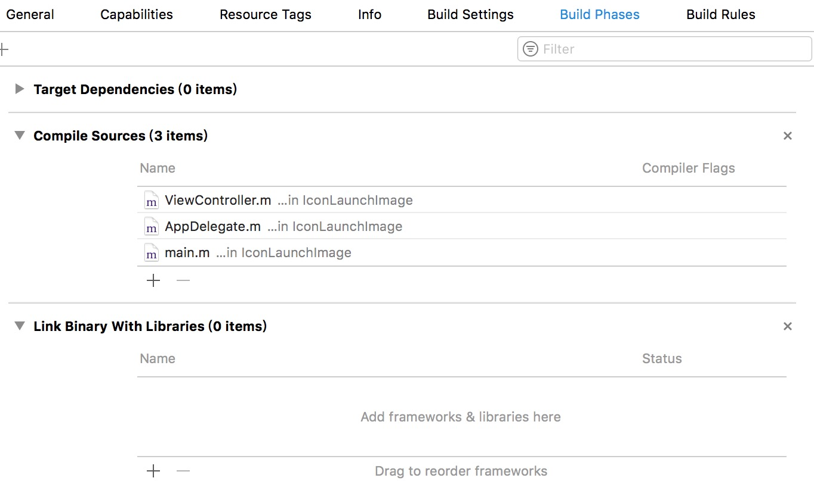
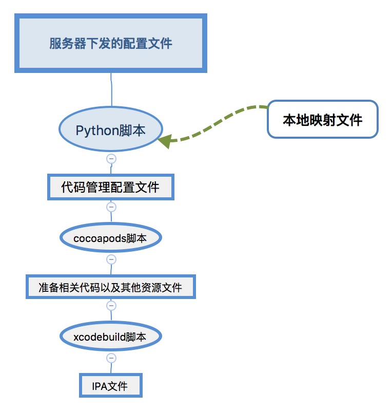
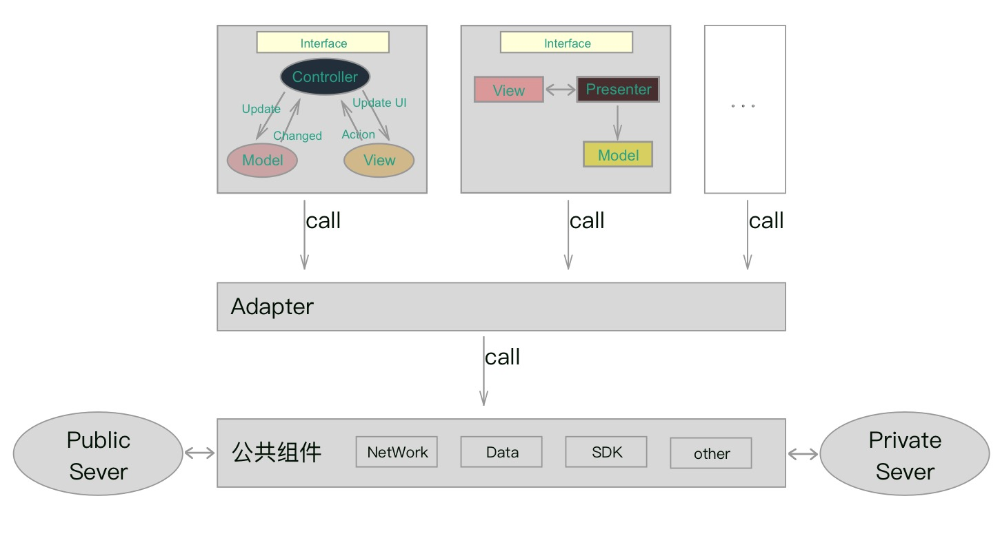
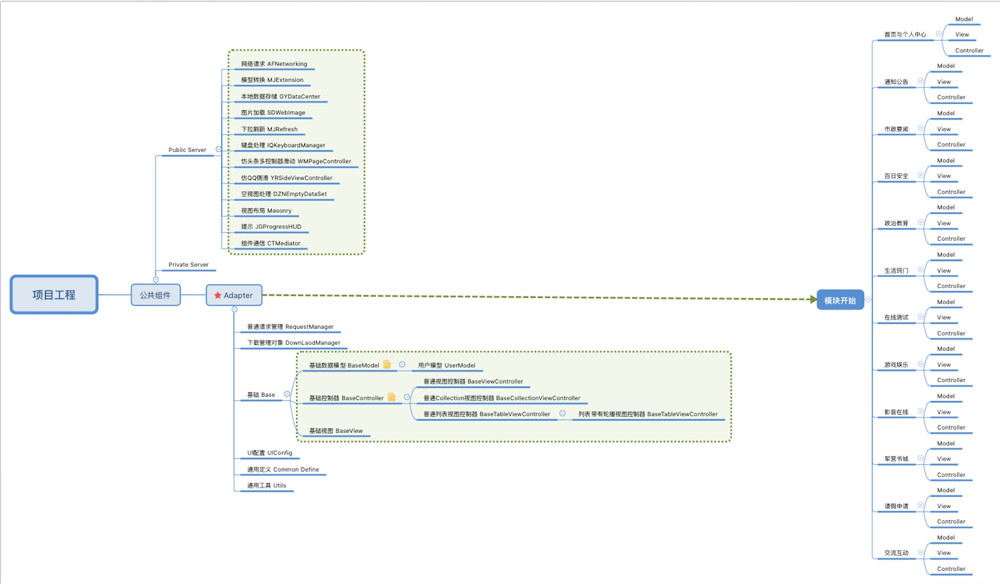

##探寻IOS组件化开发与持续集成
写代码不是请客吃饭，不是做文章,不是绘画绣花,不能那样雅致,那样从容不迫,文质彬彬,那样温良恭俭让。写代码是暴动，是一个bug推翻另一个bug的暴烈的行动。开篇模仿《鬼吹灯》，其实这是改编自《毛主席语录》的一部分。

####*我不是架构师，我也不是项目经理，我也不是产品经理，但是我要做模块化开发，我要做一个体验对得起自己的APP*

**别吹了，赶紧把话题拉回来**

**持续集成** 想必大家都熟悉，当然我们的需求不是这么简单，看需求：

__从配置到打包的时候，我们全程不开Xcode，全程不开Xcode__

我们公司有个销售(小学毕业，嘴皮子好，能忽悠，英文只会“哈喽”，单词他不会写)，出门背着我们公司的惠普电脑，出去卖我们的产品，我们一共做了100个模块(有点夸张哈~)，他想这么做：有个后台管理，他可以去配置这个app有几个模块(app桌面图标、启动图、皮肤、视图布局)，当然根这个模块不相关的代码、SDK什么之乎者也的东西不能打包进来，完了直接生成一个二维码。当然这个过程测试的也可能用到
首先我们看下我们要做什么

 你要在服务器放一个脚本，双击完了就自动执行完事所有的操作，其实到打包出来ipa文件之后就没你事了，我们看看都需要做什么工作
 
__我们全程不开Xcode，全程不开Xcode__
 
 > * 更换APP桌面图标、启动图
 > * 更改info.plist 中的参数（应用名称、bundleID、APP版本、构建版本等等）
 > * link对应模块的代码、资源、SDK
 > * 打包的时候指定签名
 > * 更换APP内部页面的配色方案、布局(这个是代码内部的事，不在考虑范围内)
 
 
 
 __瞅瞅啊，我们的主要工作就是写一个脚本__
 > * 第一条：(linux 或者 Python)脚本可以搞定
 > * 第二条：(linux 或者 Python)脚本可以搞定
 > * 第三条：(linux 或者 Python) + cocoapods可以搞定
 > * 第四条：fir 或者 xcodebuild可以搞定

###我们挨个坑踩踩啊
**更换APP桌面图标、启动图**

要替换我们工程里已有的图片，名字大小都不能有差异，桌面那个icon尺寸不对，一言不合就报错。首先一脸懵逼的样子是因为啥呢？因为我不会Python啊？百度Python学习吧，基础操作就足够了 字符串、数组、字典、文件操作，系统的学呢，推荐个网站 [廖雪峰的官方网站](http://www.liaoxuefeng.com/)。
这里呢就解决了前两个 **plist** 和 **图图**

**link对应模块的代码、资源、SDK**

哦？这个……别人给我个方案，你保证你的代码模块之间O耦合，打包之前copy到你的工程里。可是，我没有连接到工程里，也不会被编译打包进来。那怎么办？只能曲线救国了，模块都当成静态库，再通过脚本修改配置，那还是没有连接上，要添加到这个位置才能被编译打包进去

噶，灵感一来，我们还有个神器啊**cocoapods**，执行一句 update(pod update --no-repo-update)，需要的代码就连接进来了。后面要准备一长篇文章介绍cocoapods的使用，如何用cocoapods管理你的**.h .m .xin .png .a .framework**，
如何配置podspec文件，实现pod  公共服务器上的资源配置、私有服务器上的资源配置、本地资源配置。这里我们就要深入的追究podspec文件中各个参数的意义，不只是让别人pod search到你你写的东西，我们还有更多的工作要做， 在cocoapods文章中会详细讲解。

我的理解是cocoapods帮你解决了你不会用linux命令配置工程的问题(动态连接、动态配置search path等等)

podFile里也有一部分学问，我们都是通过脚本去动态配置的，以后会讲到。

**时间充足的话后面会讲述如何如何像友盟一样把微信、QQ、微博等的.a .framework .bundle 集成到一个静态库里。**

**打包的时候指定签名**

这个就不深入讲解了，主要是讲不明白，参数太多了，我们只用个基础的就可以了，可能因为cocoapods帮我们解决了好多，解决啥了？不知道……

##程序设计
这个不敢多讲，讲多了就有点班门弄斧了，我就分析下我的理解吧

**0耦合需要解决的是通信问题** 

通信问题放到最后再写，目前模块之间没有通信。

我想啊，就再0耦合也得用到UIKit、Foundation吧，我索性把项目需要的经典三方都当成基础框架的一部分，中间用adapter隔离开，每个模块喜欢什么模式就用什么模式  **MVC、MVP、MVVM等等**，就下图这样(画的有点粗糙啊)

**更换皮肤、布局** 

这里就要解析服务器给的配置文件了，当然，打开xcode那就想怎么写就怎么写了，写到基础类里，那就随便调用了。

画了个草图，如下，还是有点粗糙，以后慢慢改进啊，先学先用有点不给力啊，这款软件叫 **Xmind**

##接下来几篇文章分别是 
> * **Git在脚本与cocoapods中的使用**
> * **Python、linux脚本编写** 
> * **cocoapods在模块化开发中的使用**
> * **组件化开发之组件通信**
> * **像友盟一样制作一个属于自己的集成各种三方的静态库**

感谢您阅读完毕，如有疑问，欢迎添加QQ:**714387953**(蜗牛上高速)。
**github**:[https://github.com/yhl714387953](https://github.com/yhl714387953)
如果有错误，欢迎指正，一起切磋，共同进步
如果喜欢可以**Follow、Star、Fork**，都是给我最大的鼓励
