##模块化之编写脚本
用windows电脑的时候喜欢恶搞，恶搞啥呢？比如我不想让你动我电脑的QQ，那么首先打开记事本(win + R 键入notepad 回车)，写一句定时关机的命令(500秒后关机)

```
shutdown -s -t 500
```

重启

```
shutdown -r 
```


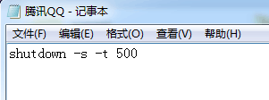

保存为 **.bat** 格式，有时候我也存为 **.cmd**  格式，名字就叫 **腾讯QQ**


在桌面创建一个快捷方式，指向刚才编写的脚本

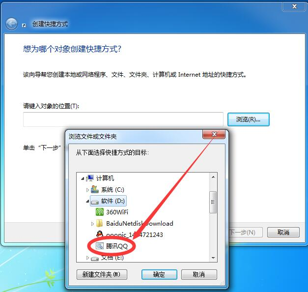

给这个快捷方式换一个QQ图标

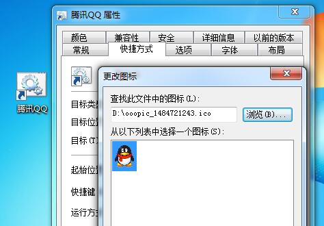

伪装成了一个假的QQ


然后不知情的吃瓜群中双击了下，要登录QQ

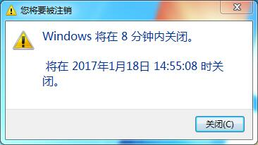

然后就不知所措了

打开命令行(win + R 键入cmd 回车), 输入

```
shutdown -a
```

取消关机


***
只是一个特别简单的脚本，当然IT干这行了，那就得让脚本为我们服务了，不能再去恶搞了

###话不多说，回到开发中解决我们实际的问题

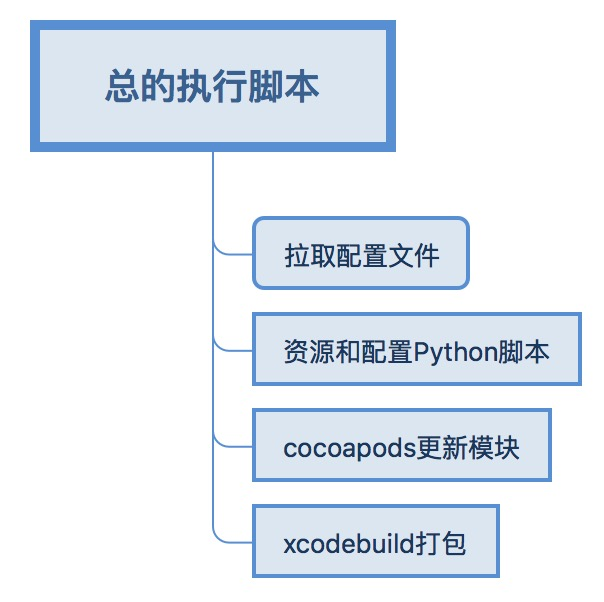

第一篇文章中讲述了我们在打包过程中要更改的一些东西：
> * APP桌面图标、启动图以及其他相关的媒体文件
> * BundleID、APP名字、APP版本等plist文件中的内容
> * 动态引用需要的代码、.a、.framework、.xib、.bundle等等模块相关的资源文件，这个我们都叫给cocoapods处理，脚本要处理的内容就是podFile文件
> * 执行打包命令

可能要写很多脚本，这里我们说几个必要的：

| 脚本           | 脚本功能  | 备注 |
|:-------------:|:---------------:| :------------:|
| 解析服务器下发的配置文件      | 这个会影响到之后所有脚本的操作，其他脚本都依赖于服务器的这个配置 |         同其它脚本一起编写 |
| 更改资源文件脚本      | 替换资源文件        |           比如app_ico |
| 更改plist文件脚本 | 修改一些配置       |            比如app名字，bunldID |
| 更改模块脚本 | 添加必要的模块代码和资源        |            用cocoapods |
| 打包脚本 | 生成IPA文件        |             |


**最后我们用一个总的脚本就调用下这几个小脚本，帮我们自动配置、打包**

我们销售人员在服务器上选了一些配置，配置选完了会执行一个配置脚本，将配置push到我的项目目录下，我pull下来然后开始配置我的文件，打包出ipa文件，再上传生成二维码。

开始逐个编写表格里需要的脚本

###更改资源文件脚本
我们就以app_icon为例吧，我们准备两套icon图标，先配置一套，然后来回切换一下看看


Config是执行脚本pull(前一句要reset --hard 一下)操作的时候拉取下来的文件夹，里面会有好多配置，比如项目里我们配置好了一套icon

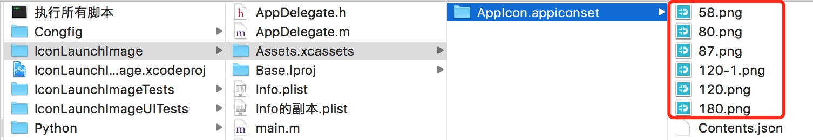

我们到python文件夹下写一段脚本，用sublime编写，保存为 .py格式

```

#!/usr/bin/env python  
#coding:utf-8  
import shutil
import os

print("**********************文件路径**************************")
#脚本存放位置
py_path = os.path.dirname(os.path.abspath(__file__))
print py_path
#脚本的上上级目录(项目的根目录)，脚本所在的目录是Python文件夹，再退一级是文件的根目录
py_parent_path = os.path.abspath(os.path.join(os.path.dirname(__file__),"..")) 
print py_parent_path

print("**********************开始拷贝icon文件**************************")

#原文件夹
source_path = py_parent_path + '/Congfig/AppIcon/Icon_1'

#目标文件夹
target_path = py_parent_path + '/IconLaunchImage/Assets.xcassets/AppIcon.appiconset'

def copyFiles(sourceDir, targetDir):
	for files in os.listdir(sourceDir):
		sourceFile = os.path.join(sourceDir, files) #源文件
		targetFile = os.path.join(targetDir, files) #目标文件
		srcIsExist = os.path.isfile(sourceFile)		#源文件是否存在
		targetIsExist = os.path.isfile(targetFile)	#目标文件是否存在 (如果不存在，对项目也没有影响)
		imgIsPNG = sourceFile.find('.png') > 0 		#目标文件是否是png格式

		if srcIsExist and imgIsPNG and targetIsExist:
			print sourceFile
			shutil.copyfile(sourceFile, targetFile)


copyFiles(source_path, target_path)


```

加了详细的注释，相信很容易就看懂了，这样我们就把icon文件给拷贝过去了，其他资源文件也可以这样操作。

接下来我得执行下看看，目录下有个黑色图标的文件 **执行所有脚本**，就shell脚本，可以理解为里面的命令都是在命令行里执行的。我们怎么执行这个.py文件呢？Mac自带python解析器，所以我们可以直接执行，在命令行执行

```
python /路径/xxx.py
```

我们看下 执行所有脚本里的内容(你问我前两行怎么不是git命令，兄弟别着急，这里是在测试脚本Demo，最后会给一个全的脚本)

```
baseDirForScriptSelf=$(cd "$(dirname "$0")"; pwd)
echo "current full path is : ${baseDirForScriptSelf}"

cd ${baseDirForScriptSelf}
cd Python

python modifyIcon.py

python modifyInfoPlist.py
```

首先第一行是获取当前脚本所在的路径，进入到python脚本所在的目录，在这个目录下执行这两个脚本，路径如下图

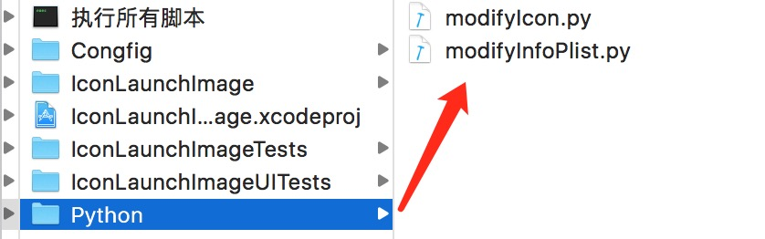

这里我们就替换了icon


###更改info.plist
plist在程序里很好改，可是在外部怎么改？，我们用sublime打卡plist看看结构

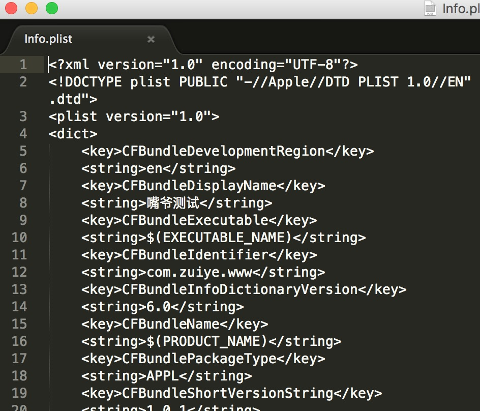

再看看我们拿到的配置文件结构

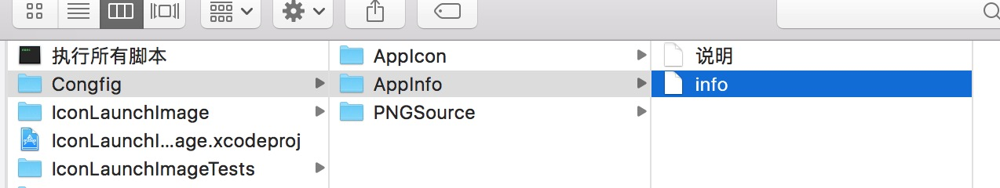

inof文件里的配置

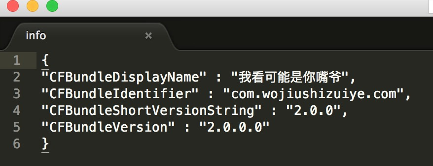


然后你可能兴奋一下，啊，这不是xml 结构的么，啊，我有一百种方式去修改了，python咋也得支持xml解析吧，那肯定支持，传说 **Python是世界上最好的语言啊** 然后呢，那就解析呗。说出来不怕大家笑话，我一开始学的是读取文件的行元素来修改的，竟然也能修改成功，当然，我是低级Python工程师，字符串还没玩明白。我曾经觉得那些在代码里  **self.button1、self.button2、self.button3……** 简直太low了，后来发现人家也照样实现功能了，使用APP的人并不知道怎么写的，索性我也low一次，接下来高能了，看注释和方法名字相信大家也能猜个大概

```
#!/usr/bin/env python  
#coding:utf-8  
import json
import os

print("**********************文件路径**************************")
#脚本存放位置
py_path = os.path.dirname(os.path.abspath(__file__))
print py_path
#脚本的上上级目录(项目的根目录)，脚本所在的目录是Python文件夹，再退一级是文件的根目录
py_parent_path = os.path.abspath(os.path.join(os.path.dirname(__file__),"..")) 
print py_parent_path

print("**********************开始拷贝icon文件**************************")

#源文件(内部是json字符串)<目前修改 CFBundleDisplayName CFBundleIdentifier CFBundleShortVersionString CFBundleVersion>
source_path = py_parent_path + '/Congfig/AppInfo/info'

#工程的infoPlist文件<最终要修改这个文件>
target_path = py_parent_path + '/IconLaunchImage/Info的副本.plist'

#返回字符串'<' 之前的空格
def preSpaceStr(line):
	print line.count('<') # 字符串的空格总数
	position = 0
	for c in line:
		if c == '<':
			break
		position = position + 1

	return line[ : position]

#获取节点之间的值 <string>aaaaaa</string>  第一个> 和倒数第一个<
def getValueInLine(line):
	start = 0
	end = 0

	for c in line:
		if c == '>':
			# print c, start
			break
		start = start + 1

	for c in reversed(line):
		if c == '<':
			# print c, end
			break
		end = end + 1	

	return line[start + 1 : -(end + 1)]

value = getValueInLine('       <key>CFBundleDisplayName</key>')	
print value

def replaceConfig():
	with open(source_path, 'r') as sf:
		infoMap = eval(sf.read())


		target_file = open(target_path)
     	try:
          	lines = target_file.readlines() #读取字符串
          	for  line in lines:
				print line
    	finally:
          	target_file.close()
	
		print 'Plist开始'

		for index, line in enumerate(lines):
			key = getValueInLine(line)
			if str(key).strip() in infoMap.keys():
				print index, key
				lines[index + 1] = preSpaceStr(line) + '<string>' + infoMap[key] + '</string>' + '\n'

		print '最后的plist'
		
		for  line in lines:
			print line

		output = open(target_path, 'w')
    	output.writelines(lines)
     	output.close()


replaceConfig()


```

不管怎么说，方法有点low，终归是解决问题了，我们之后再优化。


##更改模块脚本

配置文件存放在哪儿就不管了，假定我们最终都能找到，我们要执行如下的操作

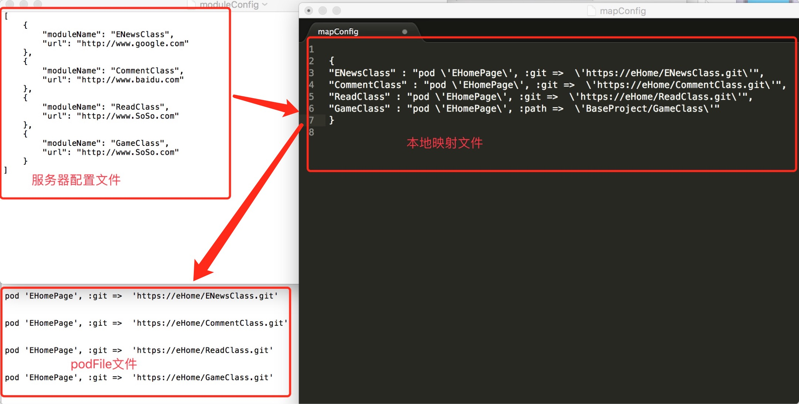

Python脚本如下(这里我们先假定他们都在一个文件夹下)，Python代码如下

```

#!/usr/bin/env python  
#coding:utf-8  
import json
import os

print("**********************打开一个文件**************************")
#脚本存放位置
#py_path = os.path.dirname(os.path.abspath(__file__))
with open(os.path.dirname(os.path.abspath(__file__)) + '/moduleConfig', 'r') as f:
    print(f.read())
print("**********************打开一个文件**************************")

print("**********************文件路径**************************")
#获取当前脚本文件路径  
print os.path.dirname(os.path.abspath(__file__))  
  
#获取当前路径的上级目录  
print os.path.abspath(os.path.dirname(os.path.dirname(__file__)))  
print os.path.abspath(os.path.join(os.path.dirname(__file__),"..")) 
print("**********************文件路径**************************")


#脚本存放位置
py_path = os.path.dirname(os.path.abspath(__file__))

# *************************函数定义开始*************************
'''
	对podFile 进行操作 将pod 需要执行的代码插入到 end 关键字之前
	podcodeLines 是待插入位置的行字符串数组
'''
def insertPodCodeToPodFile(podcodeLines):
	print("开始插入需要的代码")

	wf = open(py_path + '/codeConfig') # 返回一个文件对象
	try:
		lines = wf.readlines()
	finally:
		wf.close()
		
	
	count = 0
	remainList = []
	for index, value in enumerate(lines):
		print index, value
		remainList.append(value)
		if value.find('#***') == 0:  # 只添加分隔符之前的代码
			count = index
			break
			
	
	print('currnet line index  ' + str(count))


	print("保留的代码")
	
	remainList.append('\n\n\n')

	print("添加代码开始=========")
	for index, value in enumerate(podcodeLines):
		remainList.append(value)
		remainList.append('\n')

	remainList.append('\n\n\n')
	print("添加代码结束=========")

	remainList.append('end')
	print("最后的配置文件=======================")
	print(remainList)

	print("最后的配置文件=======================")
	
	
	output = open(py_path + '/codeConfig', 'w')
	output.writelines(remainList)
	output.close()
	

	print("**********")

########################################################################

'''
	对服务器配置文件进行操作 返回模块ID或者模块key数组 数据['NewClass', 'CommentClass']
	返回模块ID或者模块key数组 比如 ['ENewsClass', 'CommentClass', 'ReadClass', 'GameClass']
'''
def getModuleKeys():
	moduleConfig_file = open(py_path + '/moduleConfig')
	try:
	     json_text = moduleConfig_file.read( ) #读取字符串
	finally:
	     moduleConfig_file.close( )

	dicList = eval(json_text)

	keyList = []
	for  infoDic in dicList:
		keyList.append(infoDic['moduleName'])

	return keyList
	


########################################################################

'''
	读取映射文件，根据对应的key  取出来podFile 需要的代码
'''

def writePodCodeToPodFile():
	mapfile = open(py_path + '/mapConfig')
	try:
		map_json_text = mapfile.read()
	finally:
		mapfile.close()

	infos = eval(map_json_text)

	keys = getModuleKeys()

	print("当前读取到的模块key")
	print(keys)

	codeList = []

	for key in keys:
		podStr = infos[key]
		print("待添加的代码整理到一个list里")
		print(podStr)
		codeList.append(infos[key])
		codeList.append('\n')
		# insertPodCodeToPodFile(podStr)

	print(codeList)
	insertPodCodeToPodFile(codeList)

writePodCodeToPodFile()


```

##更改模块脚本
这里我们用的cocoapods，所以只需要执行一句：

```
pud update --no-repo-update
```

下一篇文章着重讲解。

##打包脚本
这个我没有证书和文件，所以打包到最后签名不对，执行起来比较慢，命令行是疯狂的编译啊

```

echo "代码更新完成，可以执行打包命令"

xcodebuild archive 
-workspace BaseProject.xcworkspace 
-scheme BaseProject 
-configuration Release 
-archivePath archive/BaseProject.xcarchive CODE_SIGN-IDENTITY="iPhone Distribution:Zuiye Zuiye Tech Co.Ltd." 
PROVISIONING_PROFILE="5477d854-6f1c-3877-b046-be9d42e9a375"

```

xcodebuild这个命令没有换行符，为了方便展示，我补了几个换行，完了就像下面这样失败了，以后有开发者帐号了，我改下，或者谁成功了直接截图给我，谢谢了！


关于xcodebuild的东西网上有好多好多，就不多说了，估计也说不明白，兄弟别气馁啊……

下一篇就是cocoapods了，这个会围绕podspec展开，敬请期待~
写的都有点紧张了，不足的地方肯定不少，欢迎大家指正，欢迎大家打我啊！

***

感谢您阅读完毕，如有疑问，欢迎添加QQ:**714387953**(蜗牛上高速)。
**github**:[https://github.com/yhl714387953](https://github.com/yhl714387953)
如果有错误，欢迎指正，一起切磋，共同进步
如果喜欢可以**Follow、Star、Fork**，都是给我最大的鼓励


